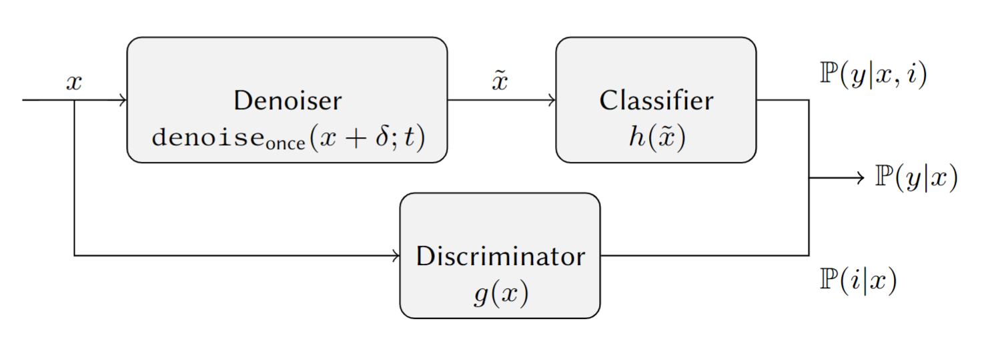
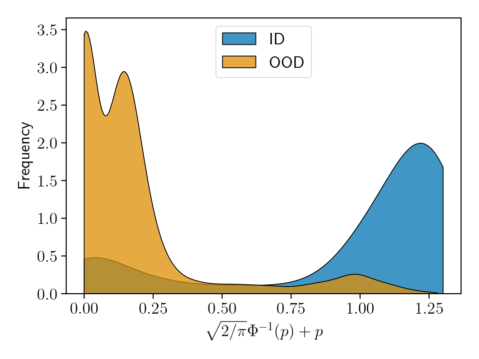

# Diffusion Denoised Smoothing for Certified and Adversarial Robust Out-Of-Distribution Detection


This repository contains the code for re-producing the experiments of the paper "[Diffusion Denoised Smoothing for Certified and Adversarial Robust Out-Of-Distribution Detection](https://arxiv.org/abs/2303.14961)" presented at [AISafety](https://www.aisafetyw.org/) workshop ([IJCAI 2023](https://ijcai-23.org/)).


###  Overview of DISTRO

Framework                  |  ID & OOD Distributions
:-------------------------:|:-------------------------:
  |  

The list of images used during training as OOD dataset has been provided in the file `openimagesv4.txt`

# Abstract

As the use of machine learning continues to expand, the importance of ensuring its safety cannot be overstated. A key concern in this regard is the ability to identify whether a given sample is from the training distribution, or is an "Out-Of-Distribution" (OOD) sample. In addition, adversaries can manipulate OOD samples in ways that lead a classifier to make a confident prediction. In this study, we present a novel approach for certifying the robustness of OOD detection within a $\ell_2$-norm around the input, regardless of network architecture and without the need for specific components or additional training.
Further, we improve current techniques for detecting adversarial attacks on OOD samples, while providing high levels of certified and adversarial robustness on in-distribution samples. The average of all OOD detection metrics on CIFAR10/100 shows an increase of ∼13%/5% relative to previous approaches.


# Installation

This code has been tested with python 3.8, torch 1.12.0+cu113 and torchvision 0.13.0+cu113

Let's create a new environment
```shell
conda create -n distro python=3.8
```
and activate it
```bash
conda activate distro
```

thus, we can install the dependencies

```bash
pip install -r requirements.txt
```

additionally we need to install [AutoAttack](https://github.com/fra31/auto-attack)
```bash
pip install git+https://github.com/fra31/auto-attack
```
## Define your enviromental variables

Please download the pre-trained models from [ProoD](https://github.com/AlexMeinke/Provable-OOD-Detection) and locate them such as 
```bash
'/your/path/to/the/models/ProoD/*'
```
where `*` is `CIFAR10` or `CIFAR100`.
Additionally download [VOS](https://github.com/deeplearning-wisc/vos), [Logit Norm](https://github.com/hongxin001/logitnorm_ood) and [Diffusion](https://github.com/openai/improved-diffusion) and place them in
```bash
'/your/path/to/the/models/our/*'
```
where `*` indicates
- `CIFAR10/vos.pt` for VOS trained on `CIFAR10`
- `CIFAR10/logitnorm.pt` for LogitNorm trained on `CIFAR10`
- `CIFAR10/denoiser.pt` for the diffusion model trained on `CIFAR10`
- `CIFAR100/denoiser.pt` for the diffusion model trained on `CIFAR100`

Please create a new `.env` file here and than specify your enviornment variables:
```bash
MODELS_PATH='/your/path/to/the/models/'
DATASETS_PATH='/your/path/to/the/datasets/'
OUTPUT_PATH='/your/path/to/the/results/'
```

# Use

```bash
conda activate distro
```

run the experiments inside this folder

```bash
python . --experiment $EXPERIMENT --clean True
```

subsitute $EXPERIMENT with one of the following:
- `plain` - Plain *ResNet* 
- `oe` - Outlier Exposure *ResNet*
- `vos` - [VOS](https://github.com/deeplearning-wisc/vos) *WideResNet* 
- `logit` - [Logit Norm](https://github.com/hongxin001/logitnorm_ood) *WideResNet* 
- `acet` - [ACET](https://github.com/max-andr/relu_networks_overconfident) *DenseNet* 
- `atom` - [ATOM](https://github.com/jfc43/informative-outlier-mining) *DenseNet* 
- `good` - [GOOD](https://github.com/j-cb/GOOD) *CNN size XL*
- `prood` - [ProoD](https://github.com/AlexMeinke/Provable-OOD-Detection) *ResNet* + *CNN size S*
- `distro` - Our work: *Diffusion* + *ResNet* + *CNN size S*


### In-Distritbuion Experiments

To compute the adversarial accuracy under the `l-inf` norm with `epsilon` equal to `2/255` or `8/255`
```bash
python . --experiment $EXPERIMENT --adv_robustness True
```
To compute the certify robustness under the `l-2` norm with `sigma` equal to `0.12` or `0.25` 
```bash
python . --experiment $EXPERIMENT --certify_robustness True
```


### Out-Of-Distribution Experiments

To compute the clean AUC, AUPR and FPR

```bash
python . --experiment $EXPERIMENT --clean True
```

To compute the guaranteed `l-inf` norm GAUC, GAUPR and GFPR with `epsilon` equal to `0.01`

```bash
python . --experiment $EXPERIMENT --guar True
```

To compute the guaranteed `l-2` norm GAUC, GAUPR and GFPR with `sigma` equal to `0.12`

```bash
python . --experiment $EXPERIMENT --certify True
```

To compute the adversarial AAUC, AAUPR and AFPR with `epsilon

```bash
python . --experiment $EXPERIMENT --adv True
```

### Additional Parameters

- `--dataset $DATASET` can be `cifar10` or `cifar100`
- `--batch_size $BATCH_SIZE`
- `--score $SCORE_FUNCTION` can be `softmax` or `energy` 


# Purpose of this project
This software was solely developed for and published as part of the publication cited above. It will neither be maintained nor monitored in any way.

# Citation
If you find our work useful in your research, please consider citing:
```
@article{franco2023diffusion,
  title={Diffusion Denoised Smoothing for Certified and Adversarial Robust Out-Of-Distribution Detection},
  author={Franco, Nicola and Korth, Daniel and Lorenz, Jeanette Miriam and Roscher, Karsten and Guennemann, Stephan},
  journal={arXiv preprint arXiv:2303.14961},
  year={2023}
}
```